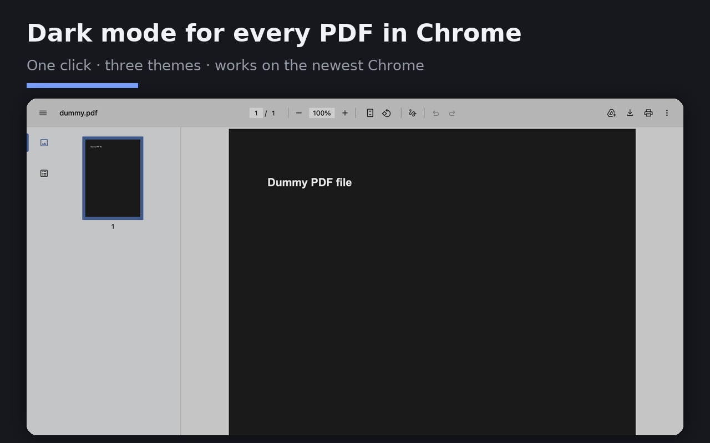
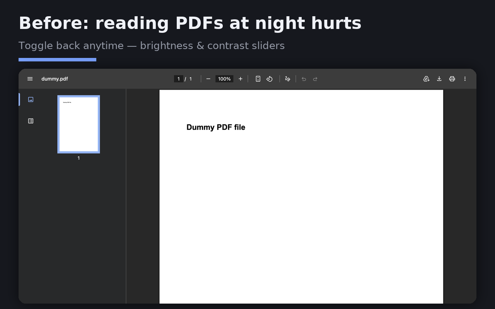

# PDF Dark Mode

It is late, you open a PDF, and Chrome hands you a full screen of white paper.

So you install a PDF dark mode extension. The listing tells you to switch on "Allow access to file
URLs", you do that, and nothing happens. The two extensions sitting at the top of the Chrome Web
Store results for `pdf dark mode` both scope themselves to `file:///*.pdf` in their manifest, so they
only ever act on a PDF opened off your own disk. The PDF you were reading came from a URL, like most
PDFs do. Their review pages are full of people finding this out one star at a time.

## What happens when you install this one

Click the toolbar icon while a PDF is open and the page goes dark. Three themes: soft dark (grey
page, warm white text), true black for OLED screens, and sepia. A brightness slider adjusts it while
you watch. Switch on "auto dark" and every PDF you open afterwards starts dark.

It works on `https://` PDFs and `file:///` PDFs alike, because it acts on Chrome's PDF viewer element
rather than on the file.





## Privacy

There is no server behind this extension. No analytics SDK, no crash reporter, no remote config, and
no network request of any kind. You can check that yourself: grep `extension/` for `fetch`,
`XMLHttpRequest`, `sendBeacon` and `WebSocket` and you will find nothing. Your theme and brightness
settings sit in `chrome.storage.local` and go nowhere.

Every permission, and why it is there:

- **`activeTab`**: access to the tab you are looking at, granted at the moment you click the icon.
  Nothing runs in the background.
- **`scripting`**: needed to inject the CSS filter that darkens the viewer. The injected functions
  live in `extension/shared.js`; they set styles and read nothing out of the page.
- **`storage`**: your theme and brightness, kept locally.
- **`<all_urls>`, optional**: requested only if you turn on "auto dark", which has to act on a PDF
  before you have clicked anything. Leave the switch off and Chrome never asks you. Decline the
  prompt and the manual toggle carries on working.

Full privacy policy: <https://liuhao04.github.io/pdf-dark-mode-extension/privacy.html>

## Install

Chrome Web Store: <https://chromewebstore.google.com/detail/cbdeadhjbdomkldbfedfphhgfaegpboc>

From source:

```
git clone https://github.com/liuhao04/pdf-dark-mode-extension.git
```

Open `chrome://extensions`, switch on Developer mode, choose **Load unpacked**, and select the
`extension/` folder. That is the same code the store build is packaged from.

## Notes

MIT licensed. Free, with no paid tier and nothing held back for one. Issues and pull requests get
read and answered as time allows, which is not a support commitment.
